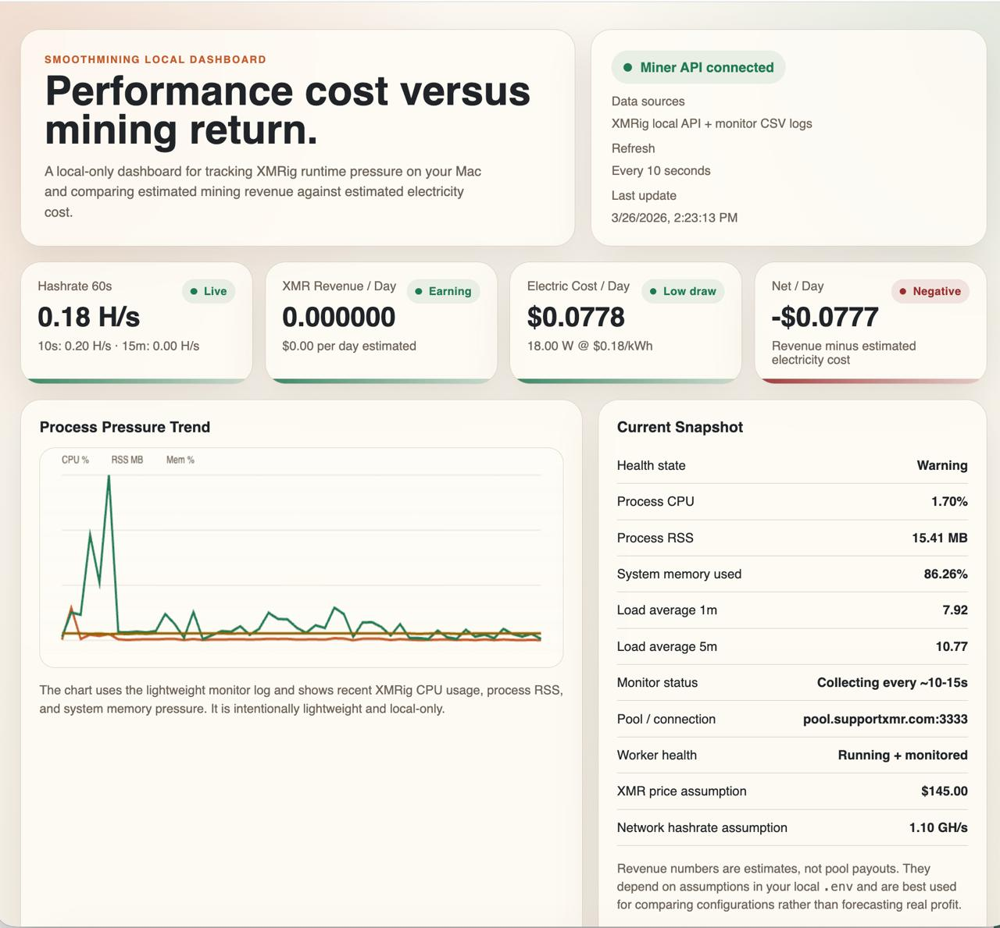

# SmoothMining

An educational low-impact Monero mining project focused on safe CPU limits, reproducible setup, and strong public documentation.

## Highlights

- Safe-first XMRig wrapper with conservative CPU defaults
- Lightweight monitor for CPU, memory pressure, and runtime trends
- Local dashboard for performance cost versus estimated mining revenue
- Portfolio-friendly documentation focused on engineering tradeoffs

## Overview

SmoothMining is a portfolio-oriented repository for experimenting with CPU mining on personal hardware in a controlled way. The project wraps a real miner workflow around XMRig while keeping the operational posture conservative: low thread counts, explicit CPU limits, local wallet ownership, and a clean setup that can be documented and benchmarked.

The goal is to learn how mining software behaves on a normal machine, not to maximize profit. This repository is designed to show practical engineering judgment around system safety, automation, and observability.

## Why This Project Stands Out

Most crypto mining side projects focus on profitability claims. This one focuses on systems thinking:

- How do you cap background resource usage safely?
- How do you measure machine impact on constrained hardware?
- How do you expose useful runtime data locally without overengineering the stack?
- How do you present an experiment honestly when the economics are weak but the technical lessons are strong?

That makes the project more credible for engineering portfolios, especially for roles involving backend systems, developer tooling, performance, automation, or observability.

## Goals

- Run XMRig with conservative defaults suitable for background use.
- Keep configuration simple and reproducible through local environment variables.
- Separate safe-to-commit project files from machine-specific secrets and runtime settings.
- Build a benchmarkable workflow that can later add metrics, charts, and findings.
- Present the project professionally for GitHub and recruiter review.

## Non-Goals

- Optimizing for real mining profitability.
- Running aggressive workloads on laptops or thermally constrained machines.
- Using exchange logins, seed phrases, or private keys inside the repository.
- Encouraging unauthorized mining on third-party infrastructure.

## Repository Layout

```text
.
├── README.md
├── .env.example
├── benchmarks/
│   └── benchmark-template.csv
├── configs/
│   └── xmrig.example.json
├── dashboard/
│   ├── index.html
│   └── server.js
├── docs/
│   ├── project-history.md
│   ├── setup-macos.md
│   ├── screenshots.md
│   └── wallet-setup.md
├── media/
│   └── dashboard/
└── scripts/
    ├── start_all.sh
    ├── start_dashboard.sh
    ├── start_xmrig_background.sh
    ├── stop_all.sh
    ├── monitor_xmrig.sh
    └── run_xmrig.sh
```

## Recommended Wallet Flow

Use an official self-custody Monero wallet and create a dedicated receive subaddress for mining payouts.

Why this is the best fit for this project:

- You fully control the payout address.
- You avoid exchange-specific asset support issues.
- You keep private material outside the repo and outside the miner configuration.

This project only needs a public receive address. Never store your seed phrase, private keys, or exchange credentials in this repository.

## Dashboard Preview

The repository includes a local-only dashboard that combines:

- XMRig local API data
- lightweight monitor logs
- estimated power cost assumptions
- estimated Monero revenue assumptions

Current screenshot:



Add more screenshots under `media/dashboard/` as the project evolves.

Suggested captures:

- main dashboard overview
- low-impact run with `1 thread`
- comparison after tuning threads or CPU limit

## Quick Start

1. Install dependencies on macOS:

   ```bash
   brew install xmrig cpulimit
   ```

2. Create your local config:

   ```bash
   cp .env.example .env
   ```

3. Edit `.env` and set your values:

   - `WALLET_ADDRESS`: your Monero receive subaddress
   - `POOL_URL`: your chosen mining pool
   - `THREADS`: start low, such as `2`
   - `CPU_LIMIT`: start conservatively, such as `50`

4. Run the safe wrapper:

   ```bash
   bash scripts/run_xmrig.sh
   ```

5. Start the lightweight monitor in another terminal:

   ```bash
   bash scripts/monitor_xmrig.sh
   ```

6. Start the local dashboard:

   ```bash
   bash scripts/start_dashboard.sh
   ```

7. Open the local page:

   ```text
   http://127.0.0.1:4173
   ```

## One-Command Control

Start everything in the background:

```bash
bash scripts/start_all.sh
```

Start everything with a custom monitor interval:

```bash
bash scripts/start_all.sh 30
```

Stop everything cleanly:

```bash
bash scripts/stop_all.sh
```

Background logs:

- `logs/xmrig.log`
- `logs/monitor.log`
- `logs/dashboard.log`

## Benchmark Workflow

Use this project as an experiment log, not just a miner wrapper.

Recommended benchmark dimensions:

- thread count
- CPU limit
- 10s, 60s, and 15m hashrate
- process RSS
- estimated system memory pressure
- estimated daily revenue
- estimated daily electricity cost
- notes about responsiveness, fan noise, and thermal behavior

Starter template:

- `benchmarks/benchmark-template.csv`
- `docs/screenshots.md`

## Safe Defaults

The starter script is intentionally conservative:

- Lower process priority through `nice`
- CPU throttling through `cpulimit` when available
- Small thread count by default
- No secrets committed to version control
- Lightweight CSV logging for background observation
- Local-only miner API for dashboarding on `127.0.0.1`

## Safety Notes

- Mining can increase heat, fan noise, and long-term hardware wear.
- Start with short runs and verify temperatures manually.
- Stop immediately if the machine becomes unstable, too hot, or heavily throttled.
- Expect educational value to be much higher than economic return on consumer CPUs.

## Documentation

- Wallet setup: `docs/wallet-setup.md`
- macOS setup: `docs/setup-macos.md`
- Project history: `docs/project-history.md`
- Screenshot checklist: `docs/screenshots.md`
- Example XMRig config: `configs/xmrig.example.json`
- Runtime monitor output: `logs/xmrig-monitor.csv`
- Local dashboard: `dashboard/index.html`

## Roadmap

1. Add a temperature collection path for macOS when available with low overhead.
2. Record benchmark sessions across multiple CPU and thread configurations.
3. Generate charts comparing hashrate, memory pressure, and estimated net return.
4. Publish a concise write-up of findings and engineering tradeoffs.
